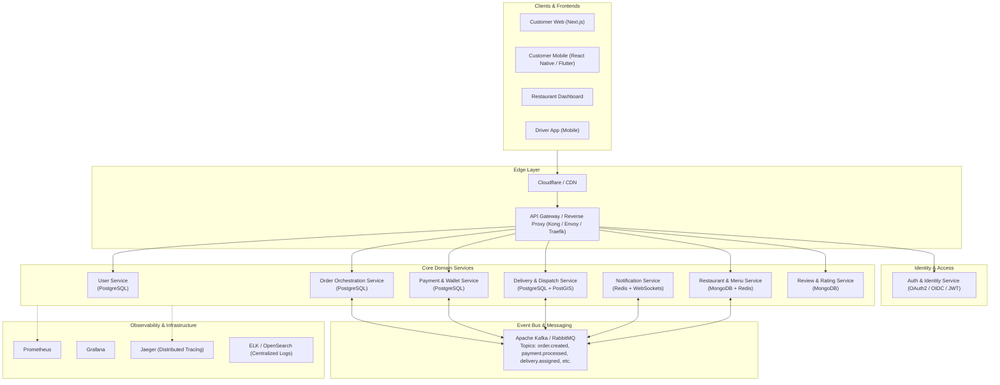
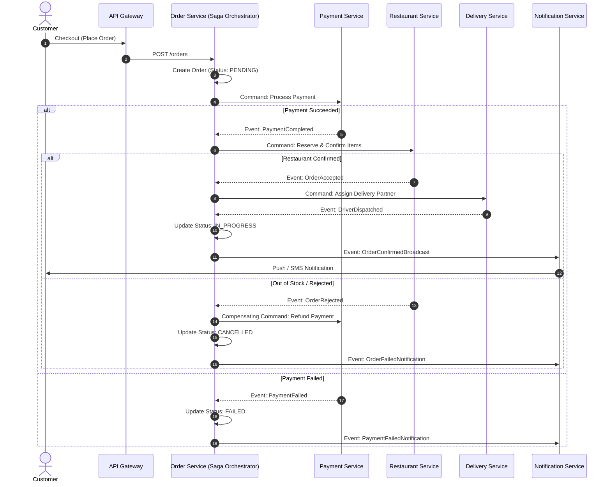

# 🍔 FoodRush - Microservices Food Ordering & Delivery Platform

[](#architecture-overview)
[](LICENSE)
[](#docker-deployment)
[](#kubernetes-deployment)
[](#event-driven-messaging)

A scalable, resilient, event-driven food ordering and delivery system built on a **Microservices Architecture**. The platform manages the entire lifecycle of an order—from restaurant menu browsing and dynamic cart calculation, through distributed payment checkout and real-time delivery dispatch, to automated status tracking.

---

## 📑 Table of Contents

- [Core Features](#-core-features)
- [Architecture Overview](#-architecture-overview)
  - [High-Level Architecture Diagram](#high-level-architecture-diagram)
  - [Distributed Transaction: Saga Pattern](#distributed-transaction-saga-pattern)
  - [Event-Driven Flow](#event-driven-flow)
- [Services Breakdown](#-services-breakdown)
- [Technology Stack](#-technology-stack)
- [Repository Structure](#-repository-structure)
- [Database Strategy: Database-per-Service](#-database-strategy-database-per-service)
- [Getting Started](#-getting-started)
  - [Prerequisites](#prerequisites)
  - [Environment Configuration](#environment-configuration)
  - [Running Locally with Docker Compose](#running-locally-with-docker-compose)
  - [Running Individual Services](#running-individual-services)
- [API Gateway & Routing](#-api-gateway--routing)
- [Observability, Monitoring & Tracing](#-observability-monitoring--tracing)
- [Security & Resilience](#-security--resilience)
- [Roadmap](#-roadmap)
- [Contributing](#-contributing)
- [License](#-license)

---

## 🚀 Core Features

- **Multi-Role Support**: Tailored experiences for Customers, Restaurant Managers, Delivery Partners, and Platform Admins.
- **Dynamic Restaurant & Menu Catalog**: Real-time inventory status, menu categories, modifier groups, and geospatial restaurant discovery.
- **Distributed Order Lifecycle Management**: End-to-end order orchestration with automated rollback mechanisms via the Saga pattern.
- **Secure Payment Processing**: Integrated payment gateways (Stripe, PayPal, digital wallets), multi-currency support, and idempotency guarantees.
- **Intelligent Delivery Dispatch**: Real-time driver location tracking, optimized route calculations, and automatic assignment algorithms.
- **Instant Real-Time Notifications**: WebSocket, SMS, Email, and Push alerts for every milestone in order preparation and transit.
- **Enterprise Observability**: Distributed tracing, centralized logging, and health monitoring across all service boundaries.

---

## 🏛 Architecture Overview

The system follows cloud-native microservice design principles: **Single Responsibility**, **Database-per-Service**, **Domain-Driven Design (DDD)**, and **Eventual Consistency via Event Sourcing & Saga Orchestration**.

### High-Level Architecture Diagram



---

### Distributed Transaction: Saga Pattern

To maintain data consistency across distributed boundaries without two-phase locking (2PC), the system implements an **Orchestrated Saga** managed by the **Order Service**:



---

### Event-Driven Flow

- **Change Data Capture (CDC) / Outbox Pattern**: Ensures events are reliably published to Kafka without dual-write failures.
- **Idempotent Consumers**: Each consumer validates idempotency keys in Redis to safely handle duplicate message deliveries.
- **Dead Letter Queue (DLQ)**: Failed message executions are routed to DLQs with automated retry backoff and alerting.

---

## 📦 Services Breakdown

| Service | Primary Responsibility | Tech Stack | Storage / Cache | Key Events / Ports |
| :--- | :--- | :--- | :--- | :--- |
| **API Gateway** | Routing, rate limiting, SSL termination, authentication validation | Envoy / Kong / Traefik | Redis (Rate Limits) | `8080` (HTTP) |
| **Auth Service** | User registration, login, JWT token issuance, RBAC, OAuth2 | Node.js / Go | PostgreSQL + Redis | `5001` / `auth.user.registered` |
| **User Service** | Customer profiles, delivery addresses, driver credentials | Go / Python / Node | PostgreSQL | `5002` / `user.profile.updated` |
| **Restaurant Service** | Menus, item variants, categories, store hours, geofencing | Node.js / NestJS | MongoDB + Redis | `5003` / `catalog.item.updated` |
| **Order Service** | Saga orchestration, cart calculations, order state machine | Go / Spring Boot | PostgreSQL | `5004` / `order.created`, `order.cancelled` |
| **Payment Service** | Stripe/PayPal integration, refund processing, ledger | Go / Java | PostgreSQL | `5005` / `payment.completed`, `payment.failed` |
| **Delivery Service** | Geolocation tracking, driver assignment, ETA calculation | Python / Go | PostgreSQL (PostGIS) + Redis | `5006` / `delivery.assigned`, `delivery.completed` |
| **Notification Service** | WebSockets, APNs/FCM push notifications, SMS (Twilio), Email | Node.js / Go | Redis (Sessions) | `5007` / `notify.send` |
| **Review Service** | Ratings, reviews, moderation, sentiment analysis | Python / Node | MongoDB | `5008` / `review.submitted` |

---

## 🛠 Technology Stack

### Backend & Microservices
- **Programming Languages**: Go / Node.js (TypeScript) / Java / Python
- **Inter-Service Communication**:
  - **Synchronous**: gRPC (Protobuf) for internal low-latency RPC, REST for public gateways
  - **Asynchronous**: Apache Kafka / RabbitMQ for event-driven pub/sub messaging
  - **Real-Time**: WebSockets & Server-Sent Events (SSE)

### Databases & Caching
- **Relational Data**: PostgreSQL (Orders, Transactions, Auth, Users)
- **Spatial Data**: PostGIS extension for geolocation and radius queries
- **Document Store**: MongoDB (Restaurant menus, customizable item trees, reviews)
- **Caching & Ephemeral Data**: Redis (Driver location coordinates, rate limits, session tokens)
- **Search Engine**: Elasticsearch / Meilisearch (Fuzzy search for restaurants and dishes)

### DevOps & Infrastructure
- **Containerization**: Docker & Docker Compose
- **Orchestration**: Kubernetes (K8s) with Helm Charts
- **Service Mesh**: Istio / Linkerd (mTLS, circuit breaking, traffic splitting)
- **CI/CD**: GitHub Actions / GitLab CI
- **Observability**: Prometheus, Grafana, OpenTelemetry, Jaeger, Loki

---

## 📁 Repository Structure

This repository is organized as a polyrepo/monorepo structure:

```text
food_order/
├── .github/
│   └── workflows/              # CI/CD pipelines (test, build, lint, deploy)
├── deploy/
│   ├── docker/                 # Production Dockerfiles & Compose configurations
│   ├── k8s/                    # Kubernetes manifests (Deployments, Services, Ingress)
│   └── helm/                   # Helm charts for multi-environment deployments
├── proto/                      # Protocol Buffer (.proto) definitions for gRPC
│   ├── auth/
│   ├── order/
│   └── delivery/
├── services/
│   ├── api-gateway/            # Gateway reverse proxy & router
│   ├── auth-service/           # Authentication & Identity Service
│   ├── user-service/           # Customer & Driver Profile Service
│   ├── restaurant-service/     # Catalog, Menus & Inventory Service
│   ├── order-service/          # Order Saga Orchestrator Service
│   ├── payment-service/        # Stripe/Payment Processing Service
│   ├── delivery-service/       # Dispatch, Tracking & Geo Service
│   ├── notification-service/   # WebSocket, Email & Push Service
│   └── review-service/         # Ratings & Feedback Service
├── shared/
│   ├── events/                 # Shared event payloads and schemas
│   ├── middleware/             # Shared auth, logging, and error-handling utilities
│   └── config/                 # Common configuration helpers
├── docker-compose.yml          # Local full-stack development orchestration
├── docker-compose.infra.yml    # Databases, Kafka, Redis & tooling only
└── README.md
```

---

## 💾 Database Strategy: Database-per-Service

Each microservice owns its private database. No service directly queries another service's storage table:

```text
+---------------------+         +---------------------+
|    Order Service    |         |   Payment Service   |
+----------+----------+         +----------+----------+
           |                               |
           v                               v
+---------------------+         +---------------------+
|   Postgres (Order)  |         |  Postgres (Payment) |
+---------------------+         +---------------------+
```

- **Data Aggregation**: Handled via API Gateway aggregation or event-driven read models (CQRS).
- **Zero Cross-Database Joins**: Replaced with asynchronous domain events and projection tables.

---

## 🚦 Getting Started

### Prerequisites

Ensure you have the following installed on your local development machine:
- [Docker](https://docs.docker.com/get-docker/) (v24.0+) & [Docker Compose](https://docs.docker.com/compose/) (v2.20+)
- [Git](https://git-scm.com/)
- [Node.js](https://nodejs.org/) (v20+) or [Go](https://go.dev/) (v1.22+) depending on service development
- [kubectl](https://kubernetes.io/docs/tasks/tools/) (optional, for cluster deployment)

---

### Environment Configuration

1. Clone the repository:
   ```bash
   git clone https://github.com/your-username/food-order-microservices.git
   cd food-order-microservices
   ```

2. Copy the sample environment file and adjust credentials:
   ```bash
   cp .env.example .env
   ```

Sample `.env` configuration:
```ini
# Environment
NODE_ENV=development
APP_SECRET=your_jwt_super_secret_key_change_in_production

# Ports
GATEWAY_PORT=8080

# Message Broker
KAFKA_BROKERS=localhost:9092
KAFKA_CLIENT_ID=food-order-system

# Redis
REDIS_HOST=localhost
REDIS_PORT=6379

# Third-Party API Keys
STRIPE_SECRET_KEY=sk_test_...
TWILIO_AUTH_TOKEN=...
GOOGLE_MAPS_API_KEY=...
```

---

### Running Locally with Docker Compose

To spin up all microservices, databases, Kafka, and the API Gateway in a single command:

```bash
# Launch background infrastructure (Postgres, Mongo, Redis, Kafka, Zookeeper)
docker compose -f docker-compose.infra.yml up -d

# Verify infrastructure health
docker compose -f docker-compose.infra.yml ps

# Launch all microservices
docker compose up --build -d
```

Check the logs of any specific service:
```bash
docker compose logs -f order-service
```

Stop all containers:
```bash
docker compose down -v
```

---

### Running Individual Services

For active development on a specific service (e.g., `order-service`), you can run infrastructure in Docker and run the service locally on your host:

```bash
# 1. Start core dependencies
docker compose -f docker-compose.infra.yml up -d postgres-order kafka redis

# 2. Navigate to service directory
cd services/order-service

# 3. Install dependencies and run migrations
npm install
npm run migrate:up

# 4. Start service with hot reload
npm run dev
```

---

## 🌐 API Gateway & Routing

All client traffic terminates at the **API Gateway** (`http://localhost:8080`).

| Route Pattern | Target Microservice | Protocol | Auth Required |
| :--- | :--- | :--- | :--- |
| `/api/v1/auth/**` | `auth-service:5001` | HTTP/REST | ❌ Public |
| `/api/v1/users/**` | `user-service:5002` | HTTP/REST | ✅ Bearer JWT |
| `/api/v1/restaurants/**` | `restaurant-service:5003` | HTTP/REST | ❌ Public (Write: Partner) |
| `/api/v1/orders/**` | `order-service:5004` | HTTP/REST | ✅ Bearer JWT |
| `/api/v1/payments/**` | `payment-service:5005` | HTTP/REST | ✅ Bearer JWT |
| `/api/v1/delivery/**` | `delivery-service:5006` | HTTP/REST | ✅ Driver / Admin |
| `/api/v1/reviews/**` | `review-service:5008` | HTTP/REST | ❌ Public / ✅ Verified Buyer |
| `/ws/notifications` | `notification-service:5007` | WebSocket | ✅ Handshake Token |

---

## 📊 Observability, Monitoring & Tracing

Microservice architectures require end-to-end visibility across network boundaries:

1. **Distributed Tracing (Jaeger / Zipkin)**:
   - Every request is tagged with a `X-Correlation-ID` header at the Gateway.
   - Trace contexts propagate through gRPC metadata and Kafka message headers.
2. **Metrics & Dashboards (Prometheus + Grafana)**:
   - Service latency (p50, p95, p99), error rates, HTTP throughput.
   - Pre-configured Grafana dashboards in `deploy/grafana/dashboards/`.
3. **Structured Centralized Logging**:
   - JSON-formatted logs with timestamps, service name, log level, and trace IDs.

Access monitoring dashboards locally:
- **Grafana**: `http://localhost:3000` (Default: `admin` / `admin`)
- **Prometheus**: `http://localhost:9090`
- **Jaeger UI**: `http://localhost:16686`
- **Kafka UI**: `http://localhost:8085`

---

## 🛡 Security & Resilience

- **Zero Trust Internal Architecture**: Internal services communicate over mutual TLS (mTLS) in Kubernetes with network policies restricting unauthorized pod access.
- **Circuit Breaker Pattern**: Resilience4j / Go breaker wraps downstream calls to prevent cascading service failure.
- **Rate Limiting**: Token bucket algorithm implemented at Gateway to thwart brute-force and DDoS attacks.
- **Data Protection**: Sensitive customer fields (passwords, payment tokens) are salted, hashed (Argon2/bcrypt), and tokenized with PCI-DSS compliance standards.

---

## 🗺 Roadmap

- [ ] **AI-Powered Recommendations**: Dynamic dish suggestions based on ordering history and dietary preferences.
- [ ] **Automated Dynamic Pricing**: Surge pricing models for delivery during peak hours and bad weather conditions.
- [ ] **Drone & Autonomous Delivery Integration**: Standardized interfaces for automated delivery vehicle telemetry.
- [ ] **Multi-Region Cluster Federation**: Cross-datacenter active-active database replication.

---

## 🤝 Contributing

Contributions are what make the open-source community an amazing place to learn, inspire, and create. Any contributions you make are **greatly appreciated**.

1. Fork the Project
2. Create your Feature Branch (`git checkout -b feature/AmazingFeature`)
3. Commit your Changes (`git commit -m 'feat: add AmazingFeature'`)
4. Push to the Branch (`git push origin feature/AmazingFeature`)
5. Open a Pull Request

Please adhere to [Conventional Commits](https://www.conventionalcommits.org/) standards.

---

## 📄 License

Distributed under the MIT License. See `LICENSE` for more information.
